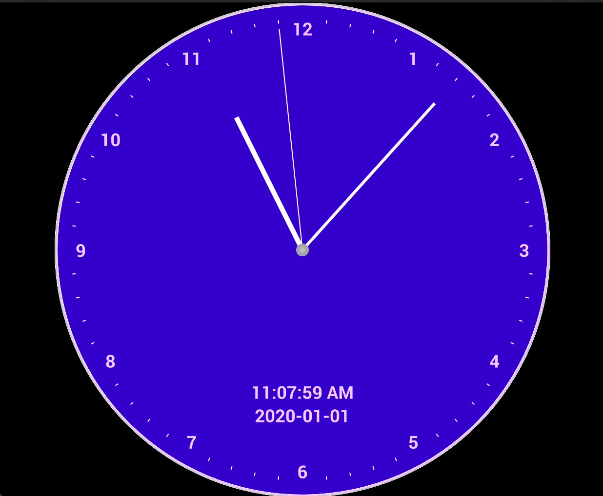
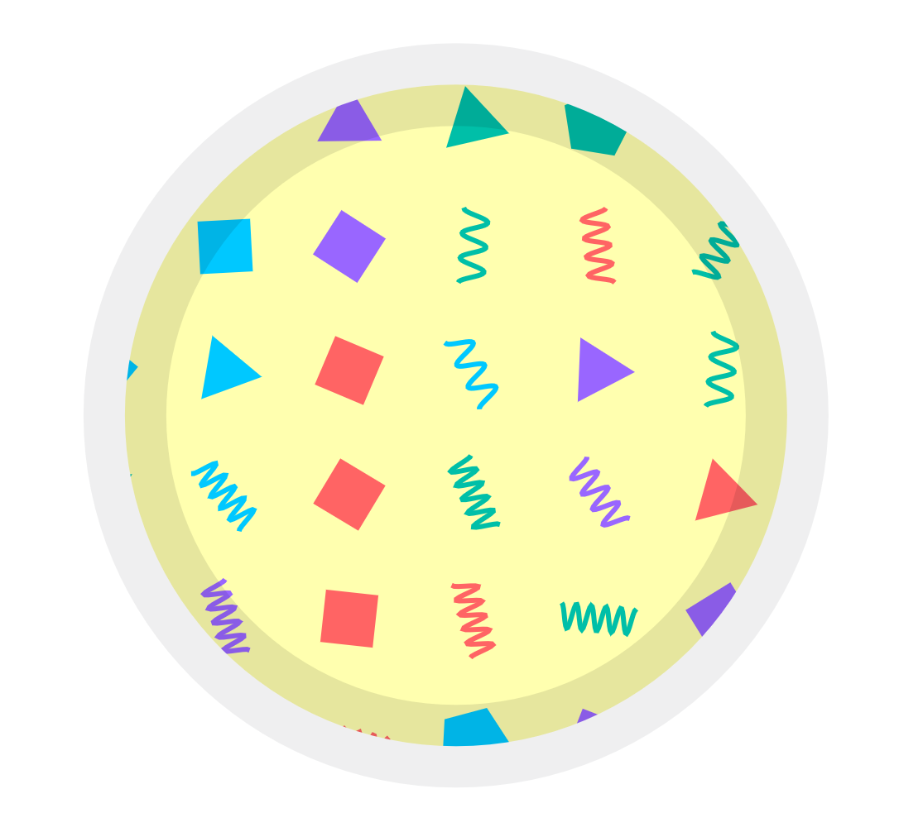
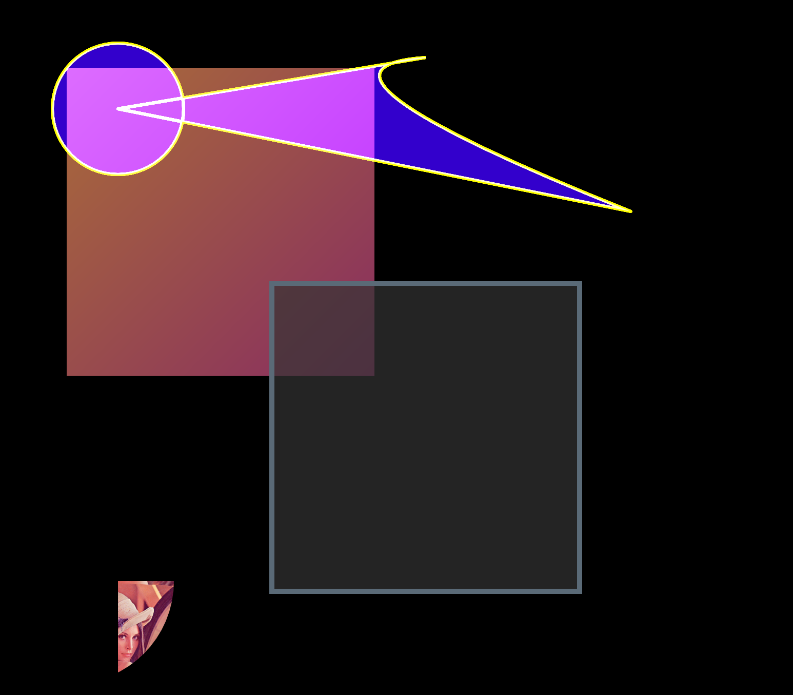

# Pure-rust implementation of NanoVG

## Demos

<table>

<tr><td><h3>Simple square</h3>

```
cargo run -p nvg-gl --example demo-square
```

The tiniest way to use nvg+glutin, can help beginner to start with nvg.

</td><td>

</td></tr>

<tr><td><h3>Clock</h3>

```
cargo run -p nvg-gl --example demo-clock
```

</td><td>

</td></tr>

<tr><td><h3>Cutout</h3>

```
cargo run -p nvg-gl --example demo-cutout
```

</td><td>
  
</td></tr>

<tr><td><h3>Draw</h3>

```
cargo run -p nvg-gl --example demo-draw
```

</td><td>
  
</td></tr>
</table>
